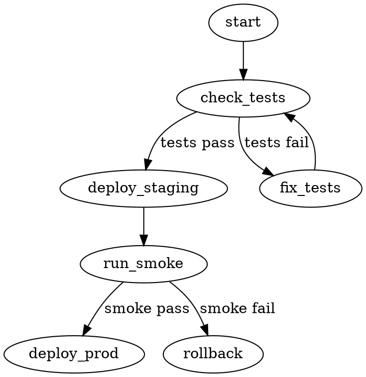

# 02. Написание Эффективных Скиллов — SOTA Техники

> **Источники:**
> - [Skill Authoring Best Practices](https://platform.claude.com/docs/en/agents-and-tools/agent-skills/best-practices) — Claude Platform
> - [Agent Skills Specification](https://agentskills.io/specification)
> - [Gemini CLI: Creating Skills](https://github.com/google-gemini/gemini-cli/blob/main/docs/cli/creating-skills.md)

---

## Принцип №1: Краткость — ключ

Контекстное окно — это **общий ресурс**. Ваш скилл делит его с:
- Системным промптом
- Историей разговора
- Метаданными других скиллов
- Фактическим запросом пользователя

### Правило по умолчанию: Агент уже очень умный

Добавляйте только то, чего агент НЕ знает. Проверяйте каждый фрагмент:
- *"Действительно ли агенту нужно это объяснение?"*
- *"Могу ли я предположить, что агент это уже знает?"*
- *"Оправдывает ли этот абзац стоимость своих токенов?"*

```markdown
# ✅ Хорошо — ~50 токенов
## Extract PDF text
Use pdfplumber for text extraction:
```python
import pdfplumber
with pdfplumber.open("file.pdf") as pdf:
    text = pdf.pages[0].extract_text()
```

# ❌ Плохо — ~150 токенов
## Extract PDF text
PDF (Portable Document Format) files are a common file format
that contains text, images, and other content. To extract text
from a PDF, you'll need to use a library. There are many libraries
available for PDF processing, but pdfplumber is recommended...
```

> Источник: [Best Practices — Concise is key](https://platform.claude.com/docs/en/agents-and-tools/agent-skills/best-practices)

---

## Принцип №2: Правильные степени свободы

Уровень детализации инструкций зависит от хрупкости операции.

### Высокая свобода (текстовые инструкции)
**Когда:** Несколько подходов валидны, решения зависят от контекста.

```markdown
## Code review process
1. Analyze the code structure and organization
2. Check for potential bugs or edge cases
3. Suggest improvements for readability
4. Verify adherence to project conventions
```

### Средняя свобода (псевдокод/скрипты с параметрами)
**Когда:** Есть предпочтительный паттерн, но вариации допустимы.

```markdown
## Generate report
Use this template and customize as needed:
```python
def generate_report(data, format="markdown", include_charts=True):
    # Process data
    # Generate output in specified format
```
```

### Низкая свобода (конкретные скрипты, без параметров)
**Когда:** Операции хрупкие, консистентность критична.

```markdown
## Database migration
Run exactly this script:
```bash
python scripts/migrate.py --verify --backup
```
Do not modify the command or add additional flags.
```

> **Аналогия:** Узкий мост с пропастями по бокам → точные инструкции. Открытое поле без опасностей → общее направление.

> Источник: [Best Practices — Set appropriate degrees of freedom](https://platform.claude.com/docs/en/agents-and-tools/agent-skills/best-practices)

---

## Правило детерминированности: `scripts/` vs LLM

> 📎 **Anthropic Guide**: «Scripts are deterministic, fast, and testable — use them for critical operations instead of hoping the LLM gets it right.»

Не все операции одинаковы. Используйте эту таблицу для выбора подхода:

| Операция | Подход | Почему |
|----------|--------|--------|
| Деплой, удаление файлов, запись в БД | **Только `scripts/`** | Критическая, необратимая — LLM может «творчески» изменить команду |
| PII-редакция, санитизация данных | **Только `scripts/`** | Детерминированность обязательна, ошибка = утечка данных |
| Валидация конфигурации | **`scripts/` + LLM интерпретация** | Скрипт проверяет, LLM объясняет результат |
| Код-ревью, анализ архитектуры | **LLM** | Требует рассуждения и контекста |
| Генерация текста, документации | **LLM** | Творческая задача |

### Паттерн: LLM как оркестратор скриптов

```markdown
## Deployment workflow
1. Validate config: `python scripts/validate_config.py config.yaml`
2. If validation passes → deploy: `bash scripts/deploy.sh --env staging`
3. Verify: `python scripts/health_check.py --url $STAGING_URL`
4. Report results to user (use your judgment to summarize)
```

LLM **вызывает** скрипты и **интерпретирует** результаты, но **не выполняет** критическую логику сам.

---

## Эффективные описания (description)

Поле `description` — это **поисковой индекс** скилла. Агент использует его для выбора из 100+ доступных скиллов.

### Правила

1. **Пишите от третьего лица** — описание инжектируется в системный промпт
2. **Будьте конкретны** — включайте ключевые слова для обнаружения
3. **Формула:** ЧТО делает + КОГДА использовать

```yaml
# ✅ Хорошо — конкретно, с триггерами
description: >
  Extract text and tables from PDF files, fill forms, merge documents.
  Use when working with PDF files or when the user mentions PDFs,
  forms, or document extraction.

# ✅ Хорошо — другой пример
description: >
  Generate descriptive commit messages by analyzing git diffs.
  Use when the user asks for help writing commit messages
  or reviewing staged changes.

# ❌ Плохо — размыто
description: Helps with documents
description: Processes data
description: Does stuff with files
```

### ⚠️ Антипаттерн: Description-as-Workflow

Если `description` описывает **шаги** (workflow), агент может решить, что тело `SKILL.md` читать не нужно — он уже «понял» что делать из описания. Результат: пропуск валидаций, скриптов и нюансов.

```yaml
# ❌ ЗАПРЕЩЕНО — шаги в description
description: >
  First analyzes the codebase, then creates a plan, then generates tests,
  then runs them and reports results.

# ✅ ПРАВИЛЬНО — только триггеры
description: >
  Generates comprehensive test suites for existing code.
  Use when the user needs unit tests, integration tests,
  or test coverage analysis.
```

**Правило:** `description` = **ЧТО** + **КОГДА**. Никогда **КАК**.

> 📎 **agentskills.io**: `name` обязан совпадать с именем директории; `description` 1-1024 символов, содержит ключевые слова для discovery.

> Источник: [Best Practices — Writing effective descriptions](https://platform.claude.com/docs/en/agents-and-tools/agent-skills/best-practices)

---

## Именование скиллов

### Рекомендуемый формат: Герундий (verb + -ing)

```
✅ processing-pdfs
✅ analyzing-spreadsheets
✅ managing-databases
✅ testing-code
✅ writing-documentation
```

### Допустимые альтернативы

```
✅ pdf-processing        (noun phrases)
✅ process-pdfs           (action-oriented)
```

### Избегать

```
❌ helper, utils, tools   (слишком общие)
❌ documents, data, files  (размытые)
```

> Источник: [Best Practices — Naming conventions](https://platform.claude.com/docs/en/agents-and-tools/agent-skills/best-practices)

---

## Токенный бюджет и Progressive Disclosure

### Правила

- Тело `SKILL.md` **одновременно** должно удовлетворять двум ограничениям:
  1. **Не более 500 строк** для оптимальной производительности
  2. **По количеству слов**: простые workflow — **< 150 слов**, сложные — **< 500 слов**
- Всё остальное выносите в `references/`
- Если контент растёт — сплитьте на отдельные файлы
- Ссылки на файлы — **максимум один уровень глубины** от `SKILL.md`
- **Запрет `@skills/name`**: не ссылайтесь на другие скиллы через `@` — это заставляет агента загрузить чужой файл в контекст. Используйте текстовые отсылки: `Use the deploying-apps skill` (без `@`).

### Правило: 1 скилл = 1 задача

> 📎 **Anthropic Guide**: Micro-skills, связанные цепочкой, надёжнее одного монолита.

Если скилл делает больше одной вещи — разбейте. Три скилла по 100 слов всегда побивают один скилл на 500 слов:
- Проще тестировать (каждый скилл — один тест)
- Точнее trigger (description фокусный, без размытия)
- Дешевле контекст (загружается только нужный скилл)

### Паттерн 1: Гайд верхнего уровня со ссылками

```markdown
---
name: pdf-processing
description: Extracts text and tables from PDF files...
---
# PDF Processing

## Quick start
Extract text with pdfplumber:
```python
import pdfplumber
with pdfplumber.open("file.pdf") as pdf:
    text = pdf.pages[0].extract_text()
```

## Advanced features
**Form filling**: See [FORMS.md](FORMS.md) for complete guide
**API reference**: See [REFERENCE.md](REFERENCE.md) for all methods
**Examples**: See [EXAMPLES.md](EXAMPLES.md) for common patterns
```

Агент загружает `FORMS.md`, `REFERENCE.md` или `EXAMPLES.md` **только при необходимости**.

### Паттерн 2: Доменная организация

```
bigquery-skill/
├── SKILL.md (обзор и навигация)
└── reference/
    ├── finance.md
    ├── sales.md
    ├── product.md
    └── marketing.md
```

Когда пользователь спрашивает о метриках продаж, агент читает только `sales.md`, не загружая финансы и маркетинг.

### Паттерн 3: Условные детали

```markdown
# DOCX Processing

## Creating documents
Use docx-js for new documents. See [DOCX-JS.md](DOCX-JS.md).

## Editing documents
For simple edits, modify the XML directly.
**For tracked changes**: See [REDLINING.md](REDLINING.md)
**For OOXML details**: See [OOXML.md](OOXML.md)
```

### ❌ Антипаттерн: Глубокая вложенность

```markdown
# Плохо — слишком глубоко
SKILL.md → advanced.md → details.md → actual-info.md

# Хорошо — один уровень
SKILL.md → advanced.md
SKILL.md → reference.md
SKILL.md → examples.md
```

> Агент может использовать `head -100` для предпросмотра файлов из вложенных ссылок, получая неполную информацию.

> Источник: [Best Practices — Progressive disclosure patterns](https://platform.claude.com/docs/en/agents-and-tools/agent-skills/best-practices)

---

## Справочные файлы длиннее 100 строк

Для длинных reference-файлов **обязательно** добавляйте оглавление:

```markdown
# API Reference

## Contents
- Authentication and setup
- Core methods (create, read, update, delete)
- Advanced features (batch operations, webhooks)
- Error handling patterns
- Code examples

## Authentication and setup
...

## Core methods
...
```

> Источник: [Best Practices — Structure longer reference files with table of contents](https://platform.claude.com/docs/en/agents-and-tools/agent-skills/best-practices)

---

## Паттерны контента

### Template Pattern — шаблон вывода

```markdown
## Report structure
ALWAYS use this exact template structure:

```markdown
# [Analysis Title]

## Executive summary
[One-paragraph overview of key findings]

## Key findings
- Finding 1 with supporting data
- Finding 2 with supporting data

## Recommendations
1. Specific actionable recommendation
```
```

### Examples Pattern — пары вход/выход

```markdown
## Commit message format

**Example 1:**
Input: Added user authentication with JWT tokens
Output:
```
feat(auth): implement JWT-based authentication
Add login endpoint and token validation middleware
```

**Example 2:**
Input: Fixed date display bug
Output:
```
fix(reports): correct date formatting in timezone conversion
```
```

### Conditional Workflow Pattern

```markdown
## Document modification workflow
1. Determine the modification type:
   **Creating new content?** → Follow "Creation workflow" below
   **Editing existing content?** → Follow "Editing workflow" below

2. Creation workflow:
   - Use docx-js library
   - Build document from scratch

3. Editing workflow:
   - Unpack existing document
   - Modify XML directly
   - Validate after each change
```

### Decision Graph Pattern (DOT-диаграммы)

Для сложных деревьев принятия решений используйте **Graphviz DOT** вместо текстовых `if/else`. Агенты лучше понимают математически строгие графы:

````markdown
## Deployment decision


````

DOT-граф не оставляет пространства для интерпретации — каждый путь явный.

> Источник: [Best Practices — Common patterns](https://platform.claude.com/docs/en/agents-and-tools/agent-skills/best-practices)

---

## Рекомендации по содержанию

### Избегайте временно-зависимой информации

```markdown
# ❌ Плохо — устареет
If you're doing this before August 2025, use the old API.

# ✅ Хорошо — использовать «old patterns» секцию
## Current method
Use the v2 API endpoint: `api.example.com/v2/messages`

## Old patterns
<details>
<summary>Legacy v1 API (deprecated 2025-08)</summary>
The v1 API used: `api.example.com/v1/messages`
</details>
```

### Используйте консистентную терминологию

| ✅ Консистентно | ❌ Несогласованно |
|-----------------|-------------------|
| Всегда "API endpoint" | Микс "API endpoint", "URL", "API route" |
| Всегда "field" | Микс "field", "box", "element" |
| Всегда "extract" | Микс "extract", "pull", "get", "retrieve" |

> Источник: [Best Practices — Content guidelines](https://platform.claude.com/docs/en/agents-and-tools/agent-skills/best-practices)

---

## Post-Generation Review (Hand-edit правило)

> 📎 **Anthropic Guide**: Даже если Claude сгенерировал скилл — **обязательно отредактируй руками**.

LLM-сгенерированные скиллы содержат типовые проблемы:

| Проблема | Как проявляется | Как исправить |
|----------|----------------|---------------|
| Многословность body | 800+ слов, повторяющиеся объяснения | Сокращай до < 500 слов |
| Description-as-workflow | Шаги в description | Оставь только триггеры (ЧТО + КОГДА) |
| Избыточные шаги | «Step 1: Understand the requirement» | Убери то, что агент делает сам |
| Отсутствие edge cases | Только happy path | Добавь «If X fails → do Y» |
| Размытые глаголы | «Handle», «Process», «Manage» | Замени на конкретные: «Extract», «Validate», «Deploy» |

### Мини-чеклист после генерации

- [ ] `description` содержит только триггеры, не шаги?
- [ ] Body < 500 слов (или < 150 для простых)?
- [ ] Скрипты в `scripts/` изолированы (нет интерактивных промптов)?
- [ ] Есть edge cases и error handling?
- [ ] Терминология консистентна (одно понятие = одно слово)?
- [ ] Нет объяснений того, что агент уже знает?
