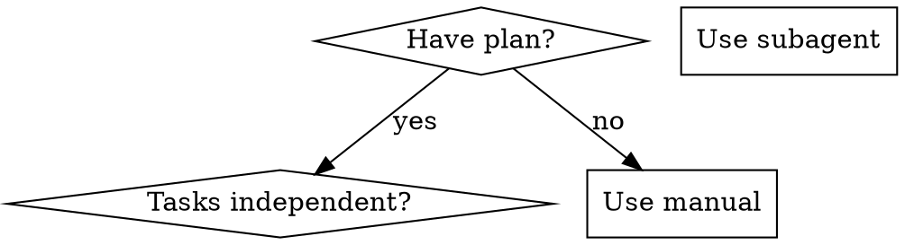

# Obra Superpowers — Исследование

> **Репозиторий:** [github.com/obra/superpowers](https://github.com/obra/superpowers)
> **Автор:** Jesse Vincent (obra)
> **Лицензия:** MIT
> **Статус:** Активный (286+ коммитов), marketplace, lab

---

## Что это

Agentic skills framework и методология разработки ПО. Не просто набор скиллов, а **полная система** из 15+ скиллов, работающих как единый pipeline:

```
brainstorming → git-worktrees → writing-plans → subagent-driven-development → TDD → code-review → finish-branch
```

### Философия

1. **Test-Driven Development** — тесты до кода, всегда
2. **Systematic over ad-hoc** — процесс важнее догадок
3. **Complexity reduction** — простота как главная цель
4. **Evidence over claims** — проверяй, прежде чем объявлять победу

---

## Ценные паттерны для наших скиллов

### 1. CSO (Claude Search Optimization) — описание = только триггеры

**Ключевое открытие:** Если `description` содержит краткое описание workflow, агент **следует описанию, а не полному SKILL.md**.

```yaml
# ❌ Агент прочитает описание и пропустит SKILL.md
description: Use for code review - dispatches subagent per task with review between tasks

# ✅ Агент прочитает полный SKILL.md
description: Use when executing implementation plans with independent tasks
```

> **Почему:** Описание с workflow = shortcut. Агент берёт "summary" из description вместо чтения инструкций.

**Вывод для наших гайдов:** Усилить правило в `02-writing-effective-skills.md` — description должен отвечать на "КОГДА", но **никогда не должен описывать workflow**.

> Источник: `writing-skills/SKILL.md` — CSO section

---

### 2. TDD для скиллов (Red-Green-Refactor для документации)

| TDD-концепт | Адаптация для скиллов |
|-------------|----------------------|
| Тест-кейс | «Сценарий давления» — запрос к субагенту |
| Код | SKILL.md |
| RED (тест падает) | Агент нарушает правило **без** скилла (baseline) |
| GREEN (тест проходит) | Агент следует правилу **с** скиллом |
| REFACTOR | Закрыть лазейки, сохранив compliance |

**Принцип:** *"Если ты не видел, как агент ошибается без скилла, ты не знаешь, чему скилл должен учить."*

**Вывод:** Можно добавить секцию о тестировании скиллов в наш чеклист — не просто "протестируй", а конкретную методологию baseline → skill → verify.

> Источник: `writing-skills/SKILL.md`, `test-driven-development/SKILL.md`

---

### 3. Anti-rationalization — защита от обходов агентом

Агенты **умные** и находят лазейки в инструкциях. Superpowers явно документирует:

| Рационализация агента | Реальность |
|-----------------------|------------|
| "Скилл очевидно ясен" | Ясен тебе ≠ ясен другому агенту |
| "Это просто справочник" | В справочниках бывают пробелы |
| "Тестирование overkill" | Нетестированные скиллы всегда имеют проблемы |
| "Я уверен что всё хорошо" | Overconfidence гарантирует проблемы |

**Техники защиты:**
- Закрыть **каждую** лазейку явно
- Построить таблицу рационализаций
- Создать список красных флагов
- Адресовать "дух vs буква" аргументы

**Вывод:** Ценная ментальная модель. Скилл должен не просто говорить "делай X", а предвидеть как агент попытается НЕ делать X — и закрыть эти пути.

> Источник: `writing-skills/SKILL.md` — Bulletproofing Skills Against Rationalization

---

### 4. Subagent-Driven Development — двухстадийное ревью

Паттерн оркестрации субагентов:

```
Implementer → Spec Reviewer → Code Quality Reviewer
                   ↑                    ↑
                   └── fix loop ←───────┘
```

**Двухстадийное ревью:**
1. **Spec compliance** — код соответствует спецификации? (ничего лишнего, ничего не пропущено)
2. **Code quality** — код хорошо написан? (naming, structure, tests)

**Порядок критичен:** Сначала spec, потом quality. Нет смысла полировать код который не соответствует спецификации.

**Prompt templates:** Каждый субагент получает отдельный prompt-файл (`implementer-prompt.md`, `spec-reviewer-prompt.md`, `code-quality-reviewer-prompt.md`).

**Вывод:** Паттерн может лечь в основу нового шаблона скилла — `orchestration-skill` для мультиагентных workflows.

> Источник: `subagent-driven-development/SKILL.md`

---

### 5. Flowcharts (Graphviz DOT) для decision logic

Superpowers активно использует **DOT-диаграммы** для деревьев решений вместо текстовых описаний:



**Вывод:** Визуальная навигация decision trees может быть эффективнее текстовых if/else в SKILL.md.

---

### 6. Типы скиллов

Superpowers выделяет три типа:

| Тип | Описание | Пример |
|-----|----------|--------|
| **Technique** | Как делать | TDD, debugging |
| **Pattern** | Ментальная модель | Subagent orchestration |
| **Reference** | Справочник | API docs, anti-patterns |

---

### 7. Red Flags list — жёсткие запреты

Каждый скилл содержит секцию **Red Flags** с **абсолютными запретами**:

```markdown
## Red Flags
**Never:**
- Start implementation on main branch without consent
- Skip reviews (spec compliance OR code quality)
- Proceed with unfixed issues
- Accept "close enough" on spec compliance
```

**Вывод:** Добавить рекомендацию в наши гайды — секция "Never" / "Red Flags" в каждом скилле как guard rail.

---

### 8. Token Efficiency (Ограничения по объёму)

Superpowers вводит строгие метрики для размера скиллов:
- getting-started workflows: < 150 слов
- Часто загружаемые скиллы: < 200 слов
- Остальные: < 500 слов

**Техники сжатия:** выносить детали во внешние файлы (если кода >50 строк), использовать `--help` вместо описания флагов внутри скилла, короткие примеры вместо развернутых диалогов.
**Вывод:** Жёсткий лимит на размер. Длинные справочники должны быть отдельными файлами (например, `pptxgenjs.md`), на которые скилл просто ссылается.

---

### 9. Отказ от @-links (Контекстная оптимизация)

Вместо прямых ссылок `@skills/name/SKILL.md` (которые заставляют агента немедленно читать файл и сжигают контекст), используется текстовое указание:
`**REQUIRED SUB-SKILL:** Use superpowers:test-driven-development`

**Вывод:** Агент сам решит, нужно ли ему вызывать этот скилл на основе его `description`. Это экономит десятки тысяч токенов контекста.

---

### 10. Глагольные названия (Naming Conventions)

Названия скиллов описывают **действие** в активном залоге (часто герундий), а не просто предметную область:
- ✅ `creating-skills`, `condition-based-waiting`, `root-cause-tracing`
- ❌ `skill-creation`, `async-test-helpers`, `debugging-techniques`

**Вывод:** Называть скиллы по тому, *что они делают*, а не *чем они являются*.

---

## Структура репозитория

```
obra/superpowers/
├── skills/                    # 15+ скиллов
│   ├── brainstorming/
│   ├── test-driven-development/
│   ├── systematic-debugging/
│   ├── writing-plans/
│   ├── executing-plans/
│   ├── subagent-driven-development/
│   ├── dispatching-parallel-agents/
│   ├── requesting-code-review/
│   ├── receiving-code-review/
│   ├── using-git-worktrees/
│   ├── finishing-a-development-branch/
│   ├── verification-before-completion/
│   ├── writing-skills/         # Мета-скилл (как писать скиллы)
│   └── using-superpowers/
├── agents/                    # Кастомные агенты
├── commands/                  # CLI команды
├── hooks/                     # Git hooks
├── lib/                       # Утилиты
├── tests/                     # Тесты скиллов
├── docs/                      # Документация
├── .claude-plugin/            # Claude Code интеграция
├── .cursor-plugin/            # Cursor интеграция
├── .opencode/                 # OpenCode интеграция
└── .codex/                    # Codex интеграция
```

---

## Что можно применить в наших скиллах

| Идея из Superpowers | Применение |
|---------------------|-----------|
| CSO (description = только триггеры) | Обновить guide 02 — усилить правило |
| Red Flags секция | Добавить в шаблоны и чеклист |
| TDD для скиллов (baseline testing) | Расширить чеклист секцией тестирования |
| Anti-rationalization | Учитывать при написании discipline-скиллов |
| DOT-диаграммы | Рассмотреть как альтернативу текстовым flowcharts |
| Prompt templates (отдельные файлы) | Паттерн для мультиагентных скиллов |
| Token Efficiency | Ввести жёсткие ограничения на объём основного SKILL.md |
| No-@ links | Запретить прямые ссылки на файлы других скиллов |
| Naming (Герундий) | Обновить правила именования скиллов в guide 01 |
